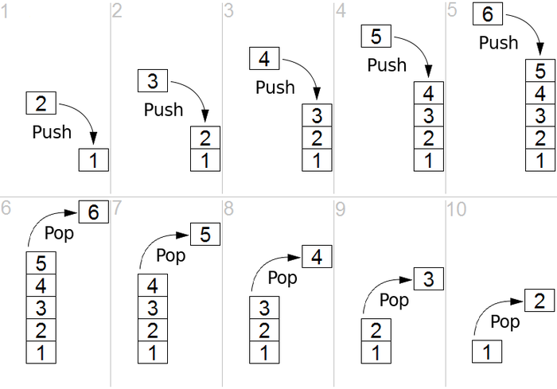
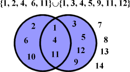
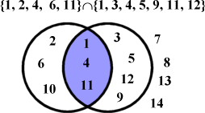

# Advanced Data Structures
In this module of the assingment we are going study to **Stacks**, **Queues**, and **Sets**.

## Stacks
Stacks are a FILO (First In Last Out) data structure.  Also known as LIFO (Laast In First Out) structures, the stack organizes  data in such a way that the user only has access to the most recent piece of data. For example, think of an email inbox. The most recent emails are at the top of the inbox and we generally start work our way down the stack of emails to the older email. Now inboxes are a complex system and we can access emails other than the top one but we can imagine it being a stack.

In order to implement a few methods in order to use our class. the `push` mothod will add an `element` to the top of the stack. The `pop` function will remove the top element off of the stack and return it to the user. Finally we will implement the `peek` method to allow us to take a look at the top element without removing from the list. The figure below illustrates the ideas behind these functions.



## Queues
Queues are a FIFO (First In First Out) data structure. The figure below show the ideas behind a queue. Think of them like a Line at the grocery store, the first person to get in the line is the first person to be helped and the first to exit the line. We will implement queues in the same way we implemented stack; with a class wrapped around a list. We will need to implemement the some of the same methods that we implemented in the `My_Stack` class. Primarily the `push`, `pop`, and `peek` methods.


---
Our implementations of stacks and queues are useful and behave exacltly like they should however 
## Strings
Strings in python are collections of characters, however they are a bit different than the collections we have looked at so far. The are *immutable*. This means that they cannot be changed once they are created. For example, if you try something like this everything works fine:

```python
	class = "Python Intermediate"
	print(class[0:5]
	print(class[7:]
```

But this **does not**.

```python
	class = "Python Intermediate"
	class[0] = 'p'
	# This throws an error because strings cannot be changed
```
So how do all of our string functions work? How can we call lower() or reverse()? Well these functions construct an entirely new string by iterating over the characters in the original string and modifying them as asked and adding them to a new string.

## Sets
Sets are very very similar to Lists with a few key exceptions, primarily a set only holds one copy of an element (for example if I have a set of numbers, the set will only hold 1 instance of any given number)

Sets have a number of different operations that we will study. Primarily we will look at the Union of sets and the Intersection of sets. When we take the *union* of sets, we create a new set that contains all of the unique elements contained in the two original set.

 

The *Intersection* of two sets results in a set that contains only the elements that exist in both of the original set. 


